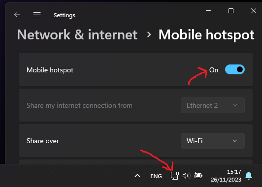

# EthernetHotspot

This program turns on the mobile hotspot on Windows 11 automatically whenever the Ethernet cable is plugged in.

It launches on startup and runs in the background, checking if Ethernet is available every 10 seconds.

To install EthernetHotspot, download and run the installer from [this link](https://github.com/gottagofaster236/RewardsTheater/releases/latest/EthernetExplorer-Installer.exe).
